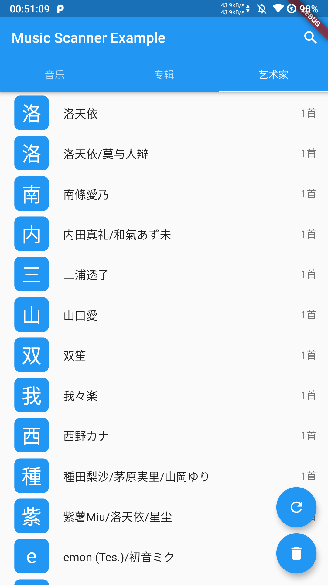

# music_scanner

Flutter音乐扫描插件

## 导入

在`pubspec.yaml`引入库
```yaml
music_scanner:
  git: https://github.com/xiaohuihuiold/music_scanner
```

## 使用方法

* 刷新专辑封面缓存:此操作会扫描生成所有专辑封面的缓存,缓存在应用data的cache/album_images内
  * `注:要显示专辑封面只有至少先刷新一次专辑封面缓存,当音乐增加后也需要刷新`
  * `注:需要读权限`
```dart
MusicScanner.refreshAlbumImagesCache();
```

* 清除专辑封面缓存:此操作会清除应用data的cache/album_images文件夹
```dart
MusicScanner.clearAlbumImagesCache();
```

* 搜索音乐音乐:从媒体库模糊搜索音乐,返回一个`MusicInfo`列表
  * `keyword`: 关键字
```dart
List<MusicInfo> musics = await MusicScanner.searchMusic(keyword);
```

* 获取所有音乐:从媒体库查询所有音乐,返回一个`MusicInfo`列表
```dart
List<MusicInfo> musics = await MusicScanner.getAllMusic();
```

* 获取所有专辑:从媒体库查询所有专辑,返回一个`AlbumInfo`列表
```dart
List<AlbumInfo> albums = await MusicScanner.getAllAlbum();
```

* 获取所有艺术家:从媒体库查询所有艺术家,返回一个`ArtistInfo`列表
```dart
List<ArtistInfo> artists = await MusicScanner.getAllArtist();
```

* 根据专辑id查找音乐:查找专辑的所有音乐,返回一个`MusicInfo`列表
  * `albumId`: 专辑id
```dart
List<MusicInfo> musics = await MusicScanner.getMusicsByAlbumId(albumId);
```

* 根据艺术家id查找音乐:查找艺术家的所有音乐,返回一个`MusicInfo`列表
  * `artistId`: 艺术家id
```dart
List<MusicInfo> musics = await MusicScanner.getMusicsByArtistId(artistId);
```

* 根据专辑id查找专辑:返回一个`AlbumInfo`对象
  * `albumId`: 专辑id
```dart
AlbumInfo album = await MusicScanner.getAlbumByAlbumId(albumId);
```

* 根据艺术家id查找艺术家:返回一个`ArtistInfo`对象
  * `artistId`: 艺术家id
```dart
ArtistInfo artist = await MusicScanner.getArtistByArtistId(artistId);
```


### 在``

## 截图




